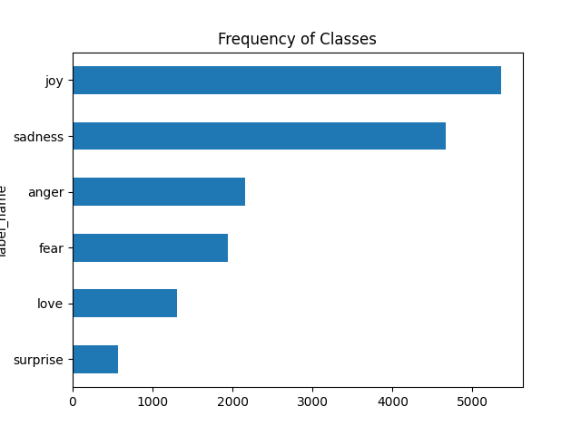
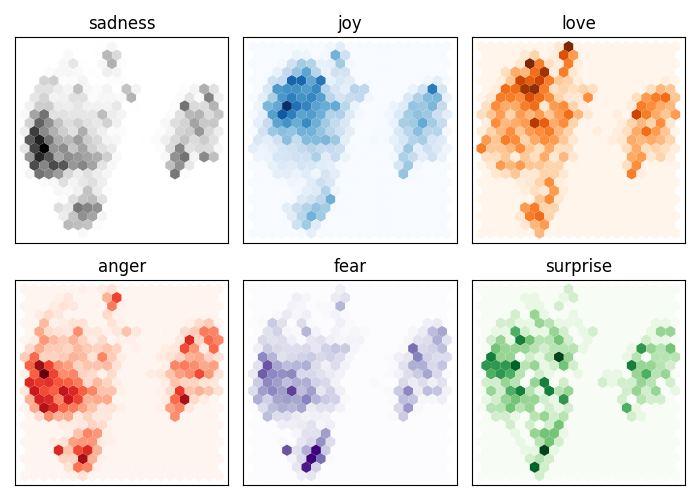
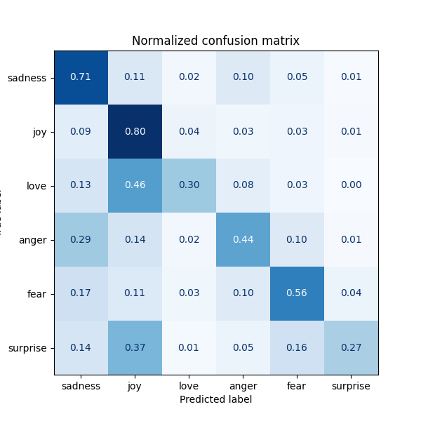
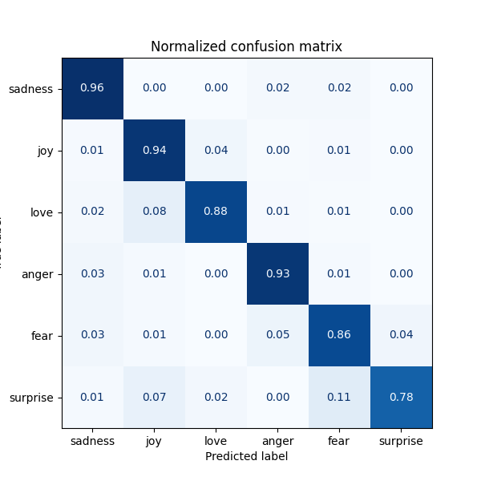

# NLP Emotion Analysis
This project is a hands-on exploration of emotion detection using transformer-based models, specifically [DistilBERT](https://huggingface.co/distilbert-base-uncased). The entire code is written in a single script to keep the flow linear, easy to follow, to allow a progressive, experimental flow where we explore tokenization, encoding, dimensionality reduction, classification, and fine-tuning.

The code includes `print()` statements to indicate progress, but **all explanations, reflections, and observations are here — in this README**.

## What You'll Find Here

- Testing the `distilbert-base-uncased` tokenizer and encoder
- Visualizing sentence embeddings using UMAP
- Training a simple Logistic Regression classifier
- Fine-tuning a pre-trained DistilBERT model on the [HuggingFace "emotion" dataset](https://huggingface.co/datasets/dair-ai/emotion)
- Evaluating performance using confusion matrix and accuracy
- Step-by-step guidance inside the code for reproducibility

The code is structured to be followed line by line. At each step.

## Purpose
This project isn't meant to be production-ready. Instead, it's a notebook-style journey to understand how modern NLP models work when applied to emotional text classification — with a touch of visual intuition and classic ML comparison.

## So...Let's Get Started 😎
It's easy to load a sample dataset using 🤗(Hugging Face) Datasets — just one line of code!

In our case, we use the `emotion` dataset, which contains short text messages labeled with emotional categories like joy, anger, sadness, and more.

### Code:
```python
print("Loading a dataset from Hugging Face Datasets")
from datasets import load_dataset

emotions = load_dataset("emotion")
```
This dataset is great for exploration: it’s small enough to experiment quickly, but rich enough to visualize patterns and train models that make meaningful predictions.
>The first time you run this, 🤗 will download the dataset and store it in your local cache (usually under `~/.cache/huggingface/`).
The next time, it loads instantly from cache — no internet required!

Once the dataset is loaded, you can, for example, check the size of it using `len`.
```python
print(f"Length of the dataset: {len(emotions)}")
```
And you can have something like this:
```
Length of the dataset: 3
```
That’s because most NLP datasets are usually split into **three** parts:
- Train: used to teach the model,
- Validation: used during training to evaluate how well the model is generalizing,
- Test: used at the very end to measure the final performance.

Why usually train, validation, and test?🤔
> Because if you train and evaluate on the same data, you're basically asking the model to recite, not to understand. We want to test if it actually **generalizes** — not just memorizes.

So, let’s check the name of the columns with `column_names`:
```python
print("Checking the structure of the dataset:", emotions["train"].column_names)
```
```
Checking the structure of the dataset: ['text', 'label']
```
This shows that each example in the dataset has two columns:
- `text`: the actual text message (like "I am so happy today!"),
- `label`: the corresponding emotion label (like "joy").

But we can go a bit deeper and explore what these columns actually contain using `.features` :
```python
print("Exploring the dataset features:", emotions["train"].features)
```
```
Exploring the dataset features: {'text': Value(dtype='string', id=None), 
'label': ClassLabel(num_classes=6, names=['joy', 'sadness', 'anger', 'fear', 'surprise', 'love'], id=None)}
```
In this case, the data type of the `text` column is ``string``, while the ``label`` column is a
special ``ClassLabel`` object that contains information about the class names and their
mapping to integers.

Now let’s dive into a classic data science habit: turning everything into a DataFrame — because if it’s not a DataFrame, did you even analyze it? 😏
```python
print("Importing pandas for DataFrame manipulation")
import pandas as pd

emotions.set_format(type="pandas")
```
This line tells 🤗 datasets to give us the data in pandas format, so we can work with it like pros (and avoid looping through dictionaries like cavemen).

After that, we can grab the training set and convert it into a DataFrame:
```python
df = emotions["train"][:]
```
DataFrame is basically a fancy table with superpowers 😋.

So... let's take a peek at what we’re working with 👀.
```python
print("Checking the structure of the DataFrame:")
print(df.head())
```
```
Checking the structure of the DataFrame:
                                                text  label
0                            i didnt feel humiliated      0
1  i can go from feeling so hopeless to so damned...      0
2   im grabbing a minute to post i feel greedy wrong      3
3  i am ever feeling nostalgic about the fireplac...      2
4                               i am feeling grouchy      3
```
Numbers are great for computers, but we humans prefer words.

So, we’ll translate the numeric label into a readable string like "joy", "anger", etc.

To do that, we’ll define a simple function:
```python
def label_int2str(row):
    return emotions["train"].features["label"].int2str(row)
```
``emotions["train"].features["label"]`` is a ClassLabel object.
This special class has a method called ``.int2str()`` which converts an integer label (e.g., ``2``) into a string label (e.g., ``joy``).

Now let’s apply it to every row:
```python
df["label_name"] = df["label"].apply(label_int2str)
```
This creates a new column called "label_name" with readable labels. 🎉

Let's check the updated DataFrame:
```python
print("Checking the new structure of the DataFrame: ")
print(df.head())
```
```
                                                text  label label_name
0                            i didnt feel humiliated      0    sadness
1  i can go from feeling so hopeless to so damned...      0    sadness
2   im grabbing a minute to post i feel greedy wrong      3      anger
3  i am ever feeling nostalgic about the fireplac...      2       love
4                               i am feeling grouchy      3      anger

```
Much better, right? 😏

Now that we’ve got our label_name column with readable emotions instead of just numbers, 
let’s visualize how balanced (or unbalanced) the dataset is — 
because not all emotions are equally represented… and that’s okay, life isn’t fair either 😅
```python
print("Visualizing the distribution of labels in the dataset")
import matplotlib.pyplot as plt

df["label_name"].value_counts(ascending=True).plot.barh()
plt.title("Frequency of Classes")
plt.show()
```
``.plot.barh()`` makes a horizontal bar chart. Why horizontal? Because it’s prettier. Just kidding... it often fits labels better

Look at that! We can see the distribution of emotions in our dataset.



You get a nice bar chart showing how emotions like joy, anger, or fear are spread across the training dataset. Great way to spot imbalances — which matter a lot for model training. For example:
there's 8000 "joy" samples but only 800 "surprise," our model might become a joy-addict. 😂

Want to fix that? Techniques like **oversampling**, **undersampling**, or **class weights** can help — but we’ll keep that for another time 😉

Next, we execute this:
```python
print("Resetting the format of the dataset to its original structure")
emotions.reset_format()
```
We’re using ``reset_format()`` to undo any temporary formatting (like converting it to pandas).
But honestly…
>**We could’ve skipped it entirely.** 
> 
>We just wanted to feel fancy and play with DataFrames for better visuals and manipulation. 🤓

So, ``emotions`` is now once again in its raw, native, ready-to-use 🤗 format!

---
Just like loading a dataset with 🤗 is easy, grabbing a model—or a part of it, like its tokenizer—is just as simple 😎.
Luckily, I’m living in this era where all these powerful tools are just a few lines of code away 😅!

>We’re not going to reinvent the wheel by coding everything from scratch—like the tokenizer and other core components. The goal here is to understand how a model works in general before trying to build one ourselves.

We now load the tokenizer associated with the transformer model `distilbert-base-uncased`.

Tokenization is the step where raw text is converted into a sequence of token IDs that the model can understand. These tokens are often subwords (like ``"play"`` + ``"##ing"``).

You can think of the tokenizer as the language of your model — without it, it simply won’t understand what you’re trying to say😝.
```python
print("Loading a pre-trained tokenizer from Hugging Face Transformers")
from transformers import AutoTokenizer

model_ckpt = "distilbert-base-uncased"
tokenizer = AutoTokenizer.from_pretrained(model_ckpt)
print("Tokenizer loaded successfully!")
```

>Just like the dataset, Hugging Face will download the tokenizer files the first time and store them in your local cache (`~/.cache/huggingface/transformers/`). Subsequent runs will reuse these files — no re-download needed.
>This is true for almost everything you load from 🤗 — whether it's a dataset, a tokenizer, or a pre-trained model, there will always be an initial download the first time.

The `distilbert-base-uncased` tokenizer is case-insensitive — "Hello" and "hello" will be treated the same.

---
After loading the tokenizer, let’s try it out on a simple example.
```python
print("Tokenizing a sample text using the pre-trained tokenizer")
text = "Tokenizing text is a core task of NLP"
print("text:", text)
encoded_text = tokenizer(text)
print(encoded_text)
tokens = tokenizer.convert_ids_to_tokens(encoded_text.input_ids)
print(tokens)
```

Here, my ``print()`` statements show:
- The original text we want to tokenize

- The raw output from the tokenizer (includes ``input_ids``, ``attention_mask``, etc.)

- The actual tokens (subwords) that correspond to each ``ID``

```
Tokenizing a sample text using the pre-trained tokenizer
text: Tokenizing text is a core task of NLP
{'input_ids': [101, 19204, 3793, 3793, 2003, 1037, 4569, 4708, 1997, 17953, 102], 
 'attention_mask': [1, 1, 1, 1, 1, 1, 1, 1, 1, 1, 1]}
['[CLS]', 'token', '##izing', 'text', 'is', 'a', 'core', 'task', 'of', 'nl', '##p', '[SEP]']
```
We get a dictionary called encoded_text, which includes:

- `input_ids`: the numerical representation of each token (word or subword)

- `attention_mask`: a very useful feature that tells the model which tokens to pay attention to and which to ignore

I'll explain `attention_mask` in more detail later — but for now, just know it's important, especially when dealing with padding or variable-length sequences.

>Notice how the word "Tokenizing" is split into 'token' and '##izing' — this is a subword tokenization strategy called WordPiece, used by BERT-based models.
The special tokens **[CLS]** and **[SEP]** are automatically added: **[CLS]** marks the start of the input, and **[SEP]** is used to separate segments.

---
So, that’s good — we know how to tokenize a single sentence.

But now, we need to tokenize every sentence in our dataset. And one thing that’s really important here… the length!

Why🤨? Transformer models like `DistilBERT` have a maximum input length (typically 512 tokens).
If a sentence is longer, it will be truncated, meaning some information will be lost. If it’s shorter, it will be padded so all inputs in a batch have the same size — this is necessary for efficient computation.

Getting padding and truncation right is crucial to avoid unexpected behavior during training and inference.

To ensure every sentence gets tokenized properly, we can give our `tokenizer` a batch of sentences and tell it:
>“Hey, if some sentences are shorter than the others, add padding to match. And if some are too long, feel free to truncate them.”

### Code:
```python
print("Define a function to tokenize a batch of texts")

def tokenize(batch):
    return tokenizer(batch["text"], padding=True, truncation=True)

print("Tokenizing the first two samples from the training set")
print(tokenize(emotions["train"][:2]))
```

Here, my `print()` statements show the output of tokenizing the first two training samples as a batch

### Output:
```
Define a function to tokenize a batch of texts
Tokenizing the first two samples from the training set
{'input_ids': [[101, 1045, 2134, 2102, 2514, 26608, 102, 0, 0, 0, 0, 0, 0, 0, 0, 0, 0, 0, 0, 0, 0, 0, 0],
 [101, 1045, 2064, 2175, 2013, 3110, 2061, 20625, 2000, 2061, 9636, 17772, 2074, 2013, 2108, 2105, 2619, 2040, 14977, 1998, 2003, 8300, 102]],
 'attention_mask': [[1, 1, 1, 1, 1, 1, 1, 0, 0, 0, 0, 0, 0, 0, 0, 0, 0, 0, 0, 0, 0, 0, 0],
 [1, 1, 1, 1, 1, 1, 1, 1, 1, 1, 1, 1, 1, 1, 1, 1, 1, 1, 1, 1, 1, 1, 1]]}
```
Like we can see, the length of our two sentences is not the same.
So, we add 0s to the attention mask to tell the future model: 
>"Ignore these parts, they are just padding."😗

Now you understand the role of the attention mask!👏

---

Okay so, now that we understand what tokenization is, and how `input_ids` and `attention_mask` work...

We are ready to tokenize the entire training set!
```python
print("Tokenizing the entire training set")
emotions_encoded = emotions.map(tokenize, batched=True, batch_size=None)
print("Tokenization complete!")
```
This will apply our `tokenize` function to every example in the dataset, all at once.
Thanks to `batched=True`, it processes the data in batches, which is more efficient 😉.

Let’s check the structure now with
```python
print("Checking the structure of the tokenized dataset :", emotions_encoded["train"].column_names)
```
```
Checking the structure of the tokenized dataset : ['text', 'label', 'input_ids', 'attention_mask']
```
You'll now see that each example contains `input_ids`, `attention_mask`, and the original labels.
And There! 🎉 Our dataset is fully tokenized and ready to be used with a Transformer model

---
Now that we have a nicely tokenized dataset, it's time to bring in the real MVP...

The pre-trained Transformer model.
```python
print("Loading a pre-trained encoder/model from Hugging Face Transformers")
import torch
from transformers import AutoModel

device = torch.device("cuda" if torch.cuda.is_available() else "cpu")
model = AutoModel.from_pretrained(model_ckpt).to(device)
print("Encoder/model loaded successfully!")
```

So what’s going on here?
- `torch.device(...)`: We check if we have a GPU (`CUDA`). If yes, we use it. If not... CPU it is.

- `AutoModel.from_pretrained(...)`: This line loads a pre-trained encoder (like `DistilBERT`, `BERT`, `RoBERTa` etc.) from 🤗 using the model checkpoint we defined earlier.

- `.to(device)`: We make sure our model goes to the same device (GPU/CPU) as our data.

The model is now ready to process tokenized inputs like a boss.

In our case, we use `DistilBERT`, which is an encoder-only Transformer.
This means we’re only interested in understanding the meaning of the sentence —
not generating new text.

The tokenizer helps split and encode the text into tokens (input IDs),
but it's the encoder (`DistilBERT`) that gives us a deeper semantic representation
of the sentence.

Think of it like this:

>The tokenizer does the surface work: splitting and encoding.
>
>The encoder does the deep thinking: what do these tokens mean together?

Note that :
>When using a pre-trained model, it is not just important — it's essential to use the same tokenizer that was used during its pretraining.
>
>Why?
>Because the model has learned to associate specific token IDs with specific word patterns based on that tokenizer.
>
>If you change the tokenizer, you’re basically changing the model’s entire language —
>like saying “cat” when you mean “bed.”

The model will still process the input, but it’ll make wrong associations —
and your performance will collapse.

Using the original tokenizer ensures the input IDs line up correctly
with what the model expects internally.

---
So now we need to extract the hidden state of the model, 
which is like peeking inside its neural brain to see what kind of representation it builds for each sentence. 
Specifically, we want the vector representation of each input — 
usually we take the ``[CLS]`` token (i.e., **the first token**) as a summary of the whole sequence.

````python
def extract_hidden_states(batch):
    inputs = {k: v.to(device) for k, v in batch.items() if k in tokenizer.model_input_names}
    with torch.no_grad():
        last_hidden_state = model(**inputs).last_hidden_state
    return {"hidden_state": last_hidden_state[:, 0].cpu().numpy()}
````
This function does the following:
- It prepares the inputs by moving them to the correct device (GPU/CPU).
- It runs the model in inference mode (no gradients needed) to get the last hidden state.
- It extracts the hidden state of the first token (`[CLS]`) for each input and returns it as a NumPy array.

Why the ``[CLS]`` token?
>Because for models like ``BERT`` and ``DistilBERT``, the first token is supposed to summarize the entire sequence, making it ideal for classification or similarity tasks.

Now, we can apply it to the entire dataset to actually extract the embeddings for all examples. 
We’ll first set the format of our dataset to PyTorch tensors — 
that way, it plays nicely with our model.
```python
print("Extracting hidden states from the tokenized dataset")
emotions_encoded.set_format("torch", columns=["input_ids", "attention_mask", "label"])
emotions_hidden = emotions_encoded.map(extract_hidden_states, batched=True)
print("Hidden states extracted successfully!")
```
Your dataset is now enriched with hidden states — essentially, 
numerical summaries of your inputs, ready for further processing like dimensionality reduction or clustering.

Now that we’ve extracted the hidden states, 
let’s make sure they were properly added to the dataset by checking the column names of the training split:
```python
print("Checking the structure of the dataset with hidden states:", emotions_hidden["train"].column_names)
```
If everything went well, you should see something like:
```
Checking the structure of the dataset with hidden states: ['text', 'label', 'input_ids', 'attention_mask', 'hidden_state']
```
---
Now that the hidden states are part of the dataset, we can extract them and convert everything into NumPy arrays — 
a format that's convenient for training traditional machine learning models like logistic regression or SVM:
```python
print("Converting the hidden states to a NumPy array")
import numpy as np

X_train = np.array(emotions_hidden["train"]["hidden_state"])
X_valid = np.array(emotions_hidden["validation"]["hidden_state"])
y_train = np.array(emotions_hidden["train"]["label"])
y_valid = np.array(emotions_hidden["validation"]["label"])
```
Always check your data shapes!

Trust me, it’ll save you from a world of pain with dimension mismatches, matrix multiplication errors, and all those “but why won’t this run?” moments.
```python
print("Shape of the training and validation data:")
print(X_train.shape, X_valid.shape)

print("Shape of the training and validation labels:")
print(y_train.shape, y_valid.shape)
```
````python
Shape of the training and validation data:
(16000, 768) (2000, 768)
Shape of the training and validation labels:
(16000,) (2000,)
````
In our case, we don't really need to worry about the shape but it’s a good habit to check.

---
So far, we've gone deep into the Transformerverse™.

We've:
- Tokenized text like chefs slicing sushi,
- Fed it into a ``DistilBERT`` encoder,
- And grabbed those sweet, juicy ``hidden states`` — the high-dimensional brainwaves of the model.

But here’s the catch, Those hidden states?

They're super high-dimensional, like **768** dimensions (or more).
Plotting that is like trying to draw the 14th dimension with a crayon. Not happening.

### So what now?
We need to reduce all that complexity down to 2 dimensions, so our puny human brains can make sense of it.
That’s where UMAP comes in — kind of like a cosmic flattening iron.

Let’s walk through the code
```python
from umap import UMAP
from sklearn.preprocessing import MinMaxScaler
```
We're importing:
- ``UMAP`` — the dimensionality-reduction master.
- ``MinMaxScaler`` — our data hygiene consultant. Keeps things between ``0`` and ``1``. Very tidy.

```python
X_scaled = MinMaxScaler().fit_transform(X_train)
```
Remember those hidden states we extracted from ``DistilBert``?
Well, they’re still messy.
So we scale them to a nice uniform range. It’s like adjusting the volume on each neuron so no one’s screaming.

```python
mapper = UMAP(n_components=2, metric="cosine").fit(X_scaled)
```
Here’s where the magic happens, We say:
>“Hey UMAP, take these 768-dimensional nightmares and project them into just 2 dimensions... but keep the cosine vibes.”

Why cosine distance?

Because direction matters more than raw distance — 
like saying two people have similar tastes in memes, even if they live on opposite sides of the Earth.

And now, we can just do
```python
df_emb = pd.DataFrame(mapper.embedding_, columns=["X", "Y"])
```
Congratulations! 🎉

You've now got a beautiful 2D version of your complex BERT-processed data.
Like turning a tangled ball of Christmas lights into a clean LED strip.

After that, we bring back the original labels to our DataFrame:
```python
df_emb["label"] = y_train
```
If you check the shape of `df_emb`, with:
```python
print("Shape of the DataFrame with embeddings:", df_emb.shape)
```
you should see:
```
Shape of the DataFrame with embeddings: (16000, 3)
```

Alright, the hard part is done. We've flattened BERT’s brainwaves, 
scaled the data, sprinkled some UMAP magic — now it's time to actually see something.

Here’s how we can visualize the embedded data:
```python
print("Visualizing the UMAP embedding of the training data")
fig, axes = plt.subplots(2, 3, figsize=(7, 5))
axes = axes.flatten()
cmaps = ["Greys", "Blues", "Oranges", "Reds", "Purples", "Greens"]
labels = emotions["train"].features["label"].names
for i, (label, cmap) in enumerate(zip(labels, cmaps)):
    df_emb_sub = df_emb.query(f"label == {i}")
    axes[i].hexbin(df_emb_sub["X"], df_emb_sub["Y"], cmap=cmap,
                   gridsize=20, linewidths=(0,))
    axes[i].set_title(label)
    axes[i].set_xticks([]), axes[i].set_yticks([])
plt.tight_layout()
plt.show()
```
You will see a grid of hexagonal bins, each representing the density of points in that area.



From this plot, we can spot some clear patterns: **negative** emotions like ``sadness``, ``anger``, and ``fear`` cluster
around similar areas, though their exact spread varies a bit.
On the flip side, ``joy`` and ``love`` stand apart from those negatives but hang out close to each other.
``Surprise``? It’s all over the place — no clear home.

Sure, we might have hoped for a clean cut between these feelings, but there’s no guarantee.
The model wasn’t trained to explicitly know the difference between emotions.
It just picked up on them implicitly by guessing masked words in text.

And honestly, this distribution makes sense — emotions like ``sadness``, `anger`, and `fear` often overlap in language,
while `joy` and `love` share a positive space.
`Surprise`, by its nature, doesn’t fit neatly anywhere, so its scatter isn’t surprising at all.

---
Now that we’ve seen how the model implicitly clusters emotions in its hidden states, let’s see if those hidden states actually carry enough signal to predict the emotion directly.

We train a simple logistic regression classifier on top of the hidden states — nothing fancy, just to test how linearly separable the emotional representations are.
```python
print("Training a logistic regression classifier on the hidden states")
from sklearn.linear_model import LogisticRegression

lr_clf = LogisticRegression(max_iter=3000)
lr_clf.fit(X_train, y_train)
print("Training complete! Accuracy on validation set:", lr_clf.score(X_valid, y_valid))
```

If the accuracy is good, that means the language model’s embeddings already capture emotional information in a way that a linear model
can exploit. If it’s low, then the emotions might be entangled in a more complex, non-linear space — 
which would also make sense.

```
Training complete! Accuracy on validation set: 0.6335
```
So… the accuracy is `63.35%`.

Not mind-blowing, but not garbage either. 
For a logistic regression just chilling on top of hidden states from a model 
that never asked to do emotion classification? That’s honestly pretty solid.

It’s like asking someone who’s never studied psychology to guess your mood based only on your tweets
— and they get it right 6 times out of 10. Not bad, random stranger. Not bad.

This tells us the embeddings do carry emotional signals. 
The model wasn’t trained for that, but it kinda picked it up just by reading tons of text. 
Like a quiet kid in the back of the class who somehow absorbs the whole lecture.

Now, 63% also means emotions aren’t linearly separable. Obviously. This is human stuff. 
Sarcasm exists. Context exists. People say “I’m fine” when they’re absolutely not.

So yeah:
- The model feels something.

- But if you want real emotional intelligence, maybe don’t trust a compressed neural network with no empathy and 12 attention heads.

Alright, so numbers are cute, but let’s dig deeper.

Overall accuracy tells us how often the model gets things right — but not where it fails, or how.

So let’s throw in a confusion matrix and see which emotions the classifier keeps mixing up.
I mean, if it thinks fear is love, we might need to talk.
```python
print("Evaluating the classifier on the validation set")
from sklearn.metrics import ConfusionMatrixDisplay, confusion_matrix


def plot_confusion_matrix(y_preds, y_true, labels):
    cm = confusion_matrix(y_true, y_preds, normalize="true")
    fig, ax = plt.subplots(figsize=(6, 6))
    disp = ConfusionMatrixDisplay(confusion_matrix=cm, display_labels=labels)
    disp.plot(cmap="Blues", values_format=".2f", ax=ax, colorbar=False)
    plt.title("Normalized confusion matrix")
    plt.show()


y_preds = lr_clf.predict(X_valid)
plot_confusion_matrix(y_preds, y_valid, labels)
```

You might see something like this:


And there it is. The confusion matrix spills the emotional tea.

- `Anger` and `fear` are most often mistaken for `sadness` — which honestly makes sense. 
If you're shouting or panicking, chances are something’s hurting underneath. The classifier’s basically going “You okay, bro?” and defaulting to sadness.

- `Love` and `surprise` often get confused with `joy`. Again, fair enough. 
Falling in love? Surprising gift? Birthday cake? All feels like joy on the surface.

This actually lines up with what we saw earlier in the embedding plot: these emotions share semantic neighborhoods — 
they show up in similar linguistic contexts, so the model learns to squish them together.

So yeah, the classifier's not dumb. It’s just… emotionally approximate. 
Like someone who hugs you when you're angry because they can't tell the difference.

---
Now, we’ve seen how the model behaves with a simple logistic regression classifier.

But what if we want to take it up a notch and fine-tune the actual `DistilBERT` model on this emotion classification task?

So, let’s do that!
```python
print("Fine-tuning a pre-trained model for sequence classification")
from transformers import AutoModelForSequenceClassification

num_labels = 6
model = (AutoModelForSequenceClassification
         .from_pretrained(model_ckpt, num_labels=num_labels)
         .to(device))
print("Model for sequence classification loaded successfully!")
```
And to evaluate the model, we need to define a few things:
```python
print("Defining a function to calculate metrics for evaluation")
from sklearn.metrics import accuracy_score, f1_score


def compute_metrics(pred):
    labels = pred.label_ids
    preds = pred.predictions.argmax(-1)
    f1 = f1_score(labels, preds, average="weighted")
    acc = accuracy_score(labels, preds)
    return {"accuracy": acc, "f1": f1}
```
This function will calculate the accuracy and F1 score of our predictions, which are standard metrics for classification tasks.

After that, we can set up the training arguments:
```python
print("Setting up the training arguments for fine-tuning")
from transformers import Trainer, TrainingArguments

batch_size = 64
logging_steps = len(emotions_encoded["train"])
model_name = f"{model_ckpt}-finetuned-emotion"
training_args = TrainingArguments(output_dir=model_name, num_train_epochs=2, learning_rate=2e-5,
                                  per_device_train_batch_size=batch_size,
                                  per_device_eval_batch_size=batch_size,
                                  weight_decay=0.01,
                                  disable_tqdm=False,
                                  logging_steps=logging_steps,
                                  push_to_hub=True,
                                  log_level="error")
```
This sets up the training parameters:
- `output_dir`: where to save the model and logs
- `num_train_epochs`: how many times to go through the training data
- `learning_rate`: how fast to learn
- `per_device_train_batch_size`: how many samples to process at once on each device (GPU/CPU)
- `weight_decay`: a regularization term to prevent overfitting
- `disable_tqdm`: whether to disable the progress bar
- `logging_steps`: how often to log training progress
- `push_to_hub`: whether to push the model to the Hugging Face Hub
- `log_level`: set to "error" to avoid too much logging noise

And finally, we can create a `Trainer` instance to handle the training loop:
```python
print(" Creating a Trainer instance for fine-tuning")
trainer = Trainer(model=model, args=training_args,
                  compute_metrics=compute_metrics,
                  train_dataset=emotions_encoded["train"],
                  eval_dataset=emotions_encoded["validation"],
                  tokenizer=tokenizer)
trainer.train()

print("Fine-tuning complete! Evaluating the model on the validation set")
```
And now, if we evaluate the model like this:
```python
print("Fine-tuning complete! Evaluating the model on the validation set")
preds_output = trainer.predict(emotions_encoded["validation"])
print("Evaluation results:", preds_output.metrics)
```
You might see something like this:
```
Evaluation results: {'test_loss': 0.21890252828598022, 
'test_accuracy': 0.9245, 'test_f1': 0.9244362486935253,
 'test_runtime': 13.8954, 'test_samples_per_second': 143.932, 
 'test_steps_per_second': 2.303}
```
This shows that the fine-tuned model achieved an `accuracy` of `92.45%` and an `F1 score` of `92.44%`
on the validation set.

This is a huge improvement over the logistic regression classifier, which only managed `63.35%` accuracy.

And yeah — that’s a massive jump. From `~63%` to over `92%`!

**Maybe you’re wondering… why does the fine-tuned model do so much better ?**

Because this time, the model isn’t relying on vague patterns in language. 
It’s actually trained to recognize emotions. The hidden states get fine-tuned,
and suddenly anger isn’t just “sad-ish with spice,” and love isn’t always “joy in disguise.” It knows what it’s looking for.

---
Alright, numbers are great, but let’s see it visually — a visualization like I love, the little moments of satisfaction in the life of a data analyst and ML practitioner.

Remember the confusion matrix from the logistic regression? Emotions were getting mixed like socks in the laundry — anger, fear, and sadness all kind of blended together, love and surprise were tagging along with joy… chaos.

Now, after fine-tuning, it’s time to check the new confusion matrix and see how much cleaner the model’s predictions got. Let’s plot it and compare.
```python
print("Plotting the confusion matrix for the fine-tuned model")
y_preds = np.argmax(preds_output.predictions, axis=1)
plot_confusion_matrix(y_preds, y_valid, labels)
```


And there it is — the moment of truth.

Look at that. `Anger`, `fear`, and `sadness` are finally separated instead of blending into a sad soup.
`Love` and `surprise` have their own space instead of crashing `joy`’s party.

Fine-tuning did its magic: the model isn’t just guessing anymore. 
It’s like it finally put on its glasses and started reading emotions properly.

Honestly, moments like this are why being a data analyst / ML practitioner is so satisfying.
You take messy numbers and turn them into something that actually makes sense — a little triumph every time.

---
And that’s a wrap for this GitHub repository notebook! 🎉

Here’s what we did:

- Grabbed a dataset from 🤗(Hugging Face).

- Had some fun with visualizations.

- Tested out `DistilBERT-base-uncased`, using its tokenizer and encoder.

- Played around with `UMAP` to see how emotions cluster in latent space.

- Built a logistic regression classifier on top — got a decent result (`~63%` accuracy).

- Then, we took it a step further and fine-tuned the `DistilBERT` classification model itself, boosting accuracy to over `92%`.

From exploring embeddings to fine-tuning a transformer, this notebook captures a full ML workflow — all the little joys of seeing messy data turn into something that actually makes sense.

And honestly, moments like this are why being a data analyst / ML practitioner is so satisfying.

